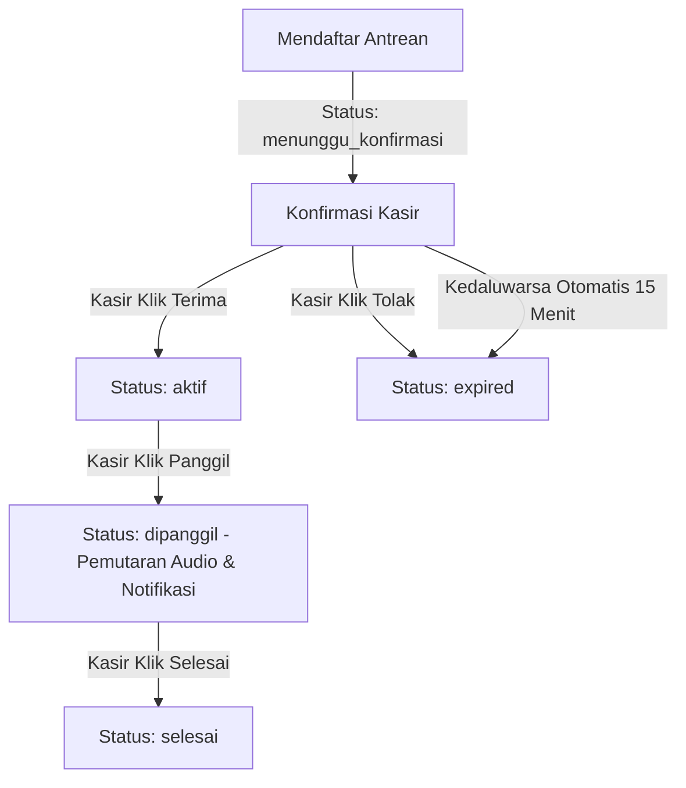

# Checkpoint Redesain Halaman Status & Notifikasi Antrean - QueueGo

Dokumen ini berfungsi sebagai spesifikasi perubahan desain dan fitur (*Product Requirements & System Specification*) yang telah diimplementasikan pada aplikasi **QueueGo** untuk meningkatkan pengalaman pengguna (UX), estetika visual, serta keandalan sistem notifikasi panggilan antrean.

---

## 1. Latar Belakang & Tujuan
Sebelumnya, halaman status antrean pelanggan terasa statis, menggunakan emoji bawaan peramban yang kurang premium, dan rentan terhadap keterlambatan pembaruan jika layar perangkat terkunci atau tab berada di latar belakang. Selain itu, belum ada fitur bagi administrator/kasir untuk menolak permintaan antrean langsung dari dasbor.

**Tujuan Implementasi:**
- Memberikan visualisasi status antrean yang modern, bersih, dan premium sesuai [DESIGN-RULES.md](file:///c:/xampp/htdocs/QueGo/DESIGN-RULES.md).
- Menghadirkan notifikasi real-time yang andal dengan memanfaatkan kombinasi Audio Synth, Web Speech Synthesis (TTS), dan Web Notifications API bawaan OS/Browser.
- Menyediakan alur pembaruan otomatis saat tab/browser diaktifkan kembali.
- Menambahkan fungsi penolakan antrean di sisi admin.

---

## 2. Fitur Utama & Detail Teknis

### A. Estetika Halaman Status Pelanggan
* **Ambient Glow Background:** Lingkaran dekoratif dengan efek blur-3xl dan opasitas rendah di latar belakang memberikan kedalaman estetika premium.
* **Ikon Jam Penantian Minimalis:** Menggantikan teks jam digital dengan wadah bulat berdenyut pastel dan ikon jarum jam line-art SVG tipis yang berputar lembut untuk kenyamanan visual.
* **Bebas Emoji Teks:** Semua simbol teks standar (seperti emoji centang atau alarm) telah diganti dengan grafik vektor SVG bawaan yang dapat menyesuaikan warna tema.

### B. Step Flow Guide (Panduan Langkah Interaktif)
Panduan tiga langkah di bagian atas kartu antrean yang melacak status antrean pengguna secara real-time:
1. **Isi Data:** Menandai pendaftaran awal (selalu berstatus *completed*).
2. **Konfirmasi Kasir:** Menampilkan status kedipan aktif saat menunggu konfirmasi kasir, dan berubah menjadi centang hitam setelah diterima.
3. **Pantau Antrean:** Aktif secara visual saat antrean telah dikonfirmasi atau dipanggil.

### C. Modal Popup Informasi Interaktif
* **Animasi Transisi Premium:** Dialog masuk dengan efek membal (*springy scale-in bounce*) menggunakan `cubic-bezier(0.34, 1.56, 0.64, 1)` dan efek memudar (*fade-in backdrop*).
* **Penyederhanaan Teks:** Menampilkan peringatan langsung: *"Harap pantau halaman browser ini secara berkala untuk melihat status antrean terbaru."* untuk menjaga fokus pengguna.
* **Persistensi Sesi:** Menggunakan `sessionStorage` agar modal hanya muncul satu kali selama sesi kunjungan pelanggan berlangsung.

### D. Keandalan Audio & Notifikasi Latar Belakang (Web Notifications API)
* **Pemicu Izin Non-Blocking:** Permintaan izin notifikasi dilakukan secara otomatis saat tombol *"Ambil Nomor Antrean"* diklik pada halaman depan, tanpa mengganggu alur pengisian data jika browser tidak mendukung.
* **Panggilan Latar Belakang:** Jika tab berada di latar belakang saat kasir memanggil nomor antrean, peramban akan mengirimkan notifikasi native OS yang dapat memicu suara dan getaran perangkat.
* **Fokus Tab Otomatis:** Mengklik spanduk notifikasi akan otomatis memfokuskan kembali tab status QueueGo.
* **Sinkronisasi Visibilitas Tab:** Menggunakan event listener `visibilitychange` untuk mendeteksi kembalinya pengguna ke tab aplikasi, yang memicu pembaruan instan data dari Supabase serta melanjutkan pemutaran bel suara antrean jika sedang dipanggil.

### E. Penolakan Antrean (Sisi Admin)
* **API Route Baru:** Endpoint `/api/admin/tolak` menerima permintaan POST untuk mengubah status tiket antrean dari `menunggu_konfirmasi` menjadi `expired`.
* **Aksi di Dasbor Admin:** Tombol *"Tolak"* dengan gaya bahaya sekunder (teks merah dengan border tipis, berubah warna latar belakang saat di-hover) ditambahkan di samping tombol "Terima" pada tab permintaan antrean.

---

## 3. Alur Kerja Sistem

### Alur Status Tiket Antrean Pelanggan

---

## 4. File-File yang Terpengaruh

1. **[status/[id]/page.tsx](file:///c:/xampp/htdocs/QueGo/queuego/src/app/status/[id]/page.tsx):**
   - Penambahan modal overlay beranimasi, sinkronisasi event `visibilitychange`, step guide dinamis, perombakan visual SVG, dan peniadaan emoji teks.
2. **[page.tsx](file:///c:/xampp/htdocs/QueGo/queuego/src/app/page.tsx):**
   - Integrasi permintaan izin notifikasi browser secara non-blocking saat submit formulir antrean.
3. **[globals.css](file:///c:/xampp/htdocs/QueGo/queuego/src/app/globals.css):**
   - Penambahan keyframes `@keyframes scaleIn` dengan kurva cubic-bezier serta kelas `.animate-scale-in` dan `.animate-fade-in`.
4. **[admin/dashboard/page.tsx](file:///c:/xampp/htdocs/QueGo/queuego/src/app/admin/dashboard/page.tsx):**
   - Integrasi tombol "Tolak" dengan penanganan status pemanggilan API.
5. **[api/admin/tolak/route.ts](file:///c:/xampp/htdocs/QueGo/queuego/src/app/api/admin/tolak/route.ts):**
   - Handler API untuk pembaruan status basis data ke `expired`.

---

## 5. Cara Pengujian
1. Buka dua jendela browser berbeda: satu untuk dasbor admin (`http://localhost:3000/admin/dashboard`) dan satu untuk pendaftaran antrean pelanggan (`http://localhost:3000`).
2. Daftarkan antrean baru. Pastikan modal persetujuan notifikasi browser muncul (jika belum disetujui).
3. Setelah dialihkan ke halaman status antrean, perhatikan kemunculan modal popup dengan efek bounce animasi yang halus.
4. Klik "Saya Mengerti" atau ikon "X" untuk menutup modal.
5. Pada dasbor admin, periksa kemunculan tiket di bagian "Permintaan". Uji fungsi tombol "Terima" atau "Tolak".
6. Jika diterima, ubah tab pelanggan ke latar belakang (misalnya membuka tab lain), lalu klik "Panggil" pada dasbor admin. Periksa notifikasi sistem native yang muncul di pojok kanan bawah PC atau pusat notifikasi perangkat HP.
